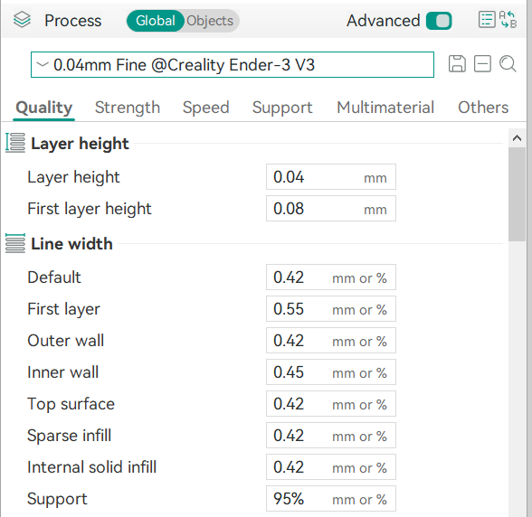

# Basic Setup

## Find you printer's magic numbers
[Here's an article](https://makershop.co/ender-3-magic-numbers/) that explains what they are and how to get them.

I just googled it.

## Printer Profile
The default profiles won't allow me to set the desired layer height because it's considered too hard to print like this.

Clone the printer profile you are currently using:
1. Give it a name. I've added 0.04lh to the name so it's easier to identify
2. Set the minimum layer height. The absolute minimum I can have is 0.04 because it's the minimum step size of my z-motors in the printer.

## Filament Profile
Also create a clone of your favorite filament profile. We are going to adjust it's settings quite a bit later.

## Process Profile
Copy a default process preset with the lowest layer height for your printer and update the layer height. now the validation logic should not be in your way!

I decided to go with the double layer height and increased line width for the first layer. To ensure good first layer adhesion.

## Next Steps
Now it's time to run some [calibration tests](../04lh-calibration/index.md)!