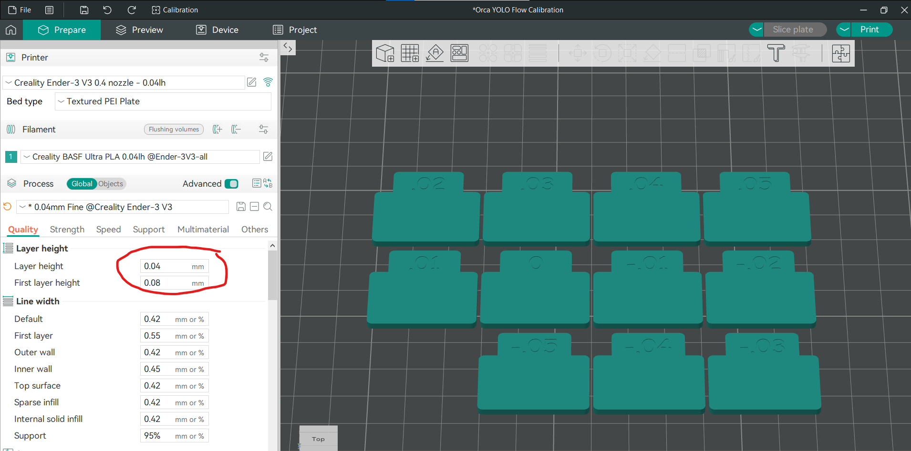

# Not so Successful calibration Experiments

## Flow
I decided to use the new flow test provided by Orca slicer called YOLO Flow test.

Created a new project and generated flow test plate using the 0.04 layer height printer, filament and process profiles.

The test generator has reset layer height settings back to 0.2, so I reverted them.

Oops, my first run showed me that I have pretty significant under-extrusion:

That's because I manually lowered the flow rate during my initial experiments while fighting with various over extrusion issues caused by other things.

Let's increase the flow rate from 0.93 to 1.03 and redo the test. Why 1.03, because we alredy know that 0.93 + 0.05 looks bad, so we need to double the offset to see the whole new range of values.

Second pass, still shows a bit of under-extrusion:

Let's do a test print and see what happens!

Nope, the flow rate is too high:

The provided test didn't quite work, so I made my own. 

Orca slicer allows you to adjust the flow for each individual object:
