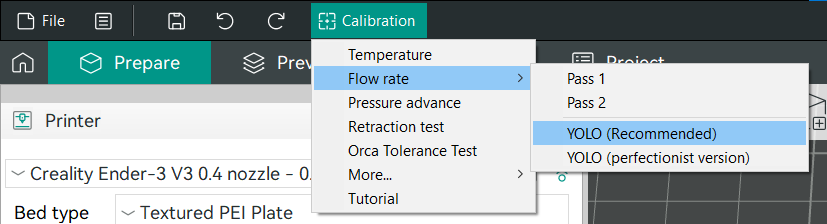
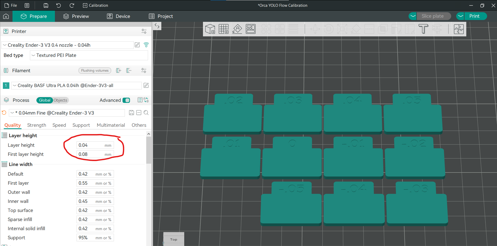

# Printer Calibration

## Prerequisites
Make sure your printer is pre-calibrated on normal settings. 
If you haven't yet calibrated extruder, flow, PA, bed leveling or your first layer go through the materials on [Ellis' Print Tuning Guide](https://ellis3dp.com/Print-Tuning-Guide/articles/index_tuning.html) first.

## Why calibrating again?
Here's a quote from [Creality's documentation](https://wiki.creality.com/en/software/creality-print/parameter-quality#h-11-layer-height-vs-configuration-file):

> 1.1 Layer height vs. configuration file
>
>  Many settings depend on **layer height**. Because layer height significantly **affects the flow rate** of material through the nozzle, many parameters of the printing process will change. This has a certain level of complexity. For example, when increasing layer height, you may need to increase the print temperature slightly to offset the additional heat loss.
>
>  Temperature affects the fluidity of the material, thereby affecting Corner sharpness and required coolingetc. Therefore, it's best to start with a preset quality profile provided by your printer that has a layer height close to your desired layer height.

So, knowing that we'll have to do an almost full recalibration using the selected filament and our target layer height:
1. Flow
2. Pressure Advance
3. And maybe temperature

## Flow
I decided to use the new flow test provided by Orca slicer called YOLO Flow test.

Created a new project and generated flow test plate using the 0.04 layer height printer, filament and process profiles.

The test generator has reset layer height settings back to 0.2, so I reverted them.

Oops, my first run showed me that I have pretty significant under-extrusion:

That's because I manually lowered the flow rate during my initial experiments while fighting with various over extrusion issues caused by other things.

Let's increase the flow rate from 0.93 to 1.03 and redo the test. Why 1.03, because we alredy know that 0.93 + 0.05 looks bad, so we need to double the offset to see the whole new range of values.