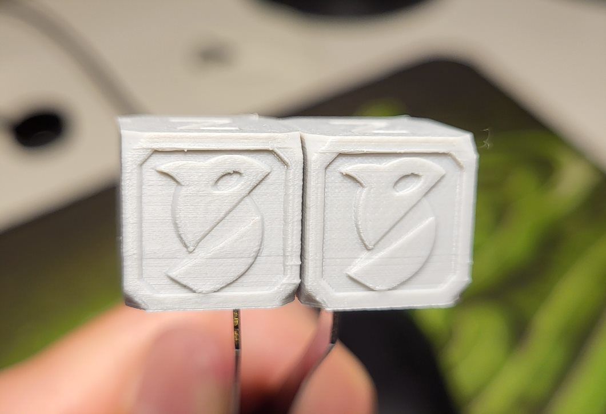

# Printer Calibration

## Prerequisites
Make sure your printer is pre-calibrated on normal settings. 
If you haven't yet calibrated extruder, flow, PA, bed leveling or your first layer go through the materials on [Ellis' Print Tuning Guide](https://ellis3dp.com/Print-Tuning-Guide/articles/index_tuning.html) first.

## Why calibrating again?
Here's a quote from [Creality's documentation](https://wiki.creality.com/en/software/creality-print/parameter-quality#h-11-layer-height-vs-configuration-file):

> 1.1 Layer height vs. configuration file
>
>  Many settings depend on **layer height**. Because layer height significantly **affects the flow rate** of material through the nozzle, many parameters of the printing process will change. This has a certain level of complexity. For example, when increasing layer height, you may need to increase the print temperature slightly to offset the additional heat loss.
>
>  Temperature affects the fluidity of the material, thereby affecting Corner sharpness and required coolingetc. Therefore, it's best to start with a preset quality profile provided by your printer that has a layer height close to your desired layer height.

So, knowing that we'll have to do an almost full recalibration using the selected filament and our target layer height:
1. Flow
2. Pressure Advance
3. PID and maybe filament temperature
4. Shapers
5. Retraction

## Things to look out for
#### Over-extrusion
To much filament might cause artifcts on the surface. This happens when extra filament starts getting dragged around perimeters by the hot end damaging existing layers that haven't yet fully solidified.

Settings that affect this:
1. First layer squish. Too much squish and you get ridges on the first layer.
2. Line widths. Too thick lines can cause filement to overflow.

# general Approach
1. Tune Flow
2. Tune first layer quish
3. Tune

# First Layer Squish
Slice some rectangles across the plate.

While printing the patches adjust x offset until it looks perfect, i.e. no ridges, pin holes and etc. The surface should be as smooth as possoble.

If adjusting z offset doesn't help, adjust first layer line width.

Set the same speed for first layer wall and infill. Keep the speed relatively low.

# Flow

Printed the Orca calibration Cube STL with the intial flow value of 1.03.

Experimented with different flow rate tests, but none of them gave useful results with 0.04 layer height. So I had to guess the flow.

Printed another calibration cube with flow set to: 0.9785 (95% of the original).

And got a much better result! Less artifacts on the surface except for uncalibrated PA and the screw almost fits now. On the negative side some line separation started on top layers. But it can be fixed by adjusting the top surface flow parameter later.

Things to improve:
1. PA!
2. Stringing

# Linear Pressure Advance

Things to consider before calibrating:
1. **Upper acceleration range**: Do **not attempt** to calibrate adaptive PA for an **acceleration that is larger than what the Klipper input shaper calibration tool recommends** for your selected shaper. For example, if Klipper recommends an EI shaper with 4k maximum acceleration for your slowest axis (usually the Y axis), don’t calibrate adaptive PA beyond that value. This is because after 4k the input shaper smoothing is magnified and the perimeter separations that appear like PA issues are caused by the input shaper smoothing the shape of the corner. Basically, you’d be attempting to compensate for an input shaper artefact with PA.

2. **Upper print speed range**: The Ellis PA pattern test has been proven to be the most efficient and effective test to run to calibrate adaptive PA. It is fast and allows for a reasonably accurate and easy-to-read PA value. However, the size of the line segments is quite small, which means that for the faster print speeds and slower accelerations, the toolhead will not be able to reach the full flow rate that we are calibrating against. It is therefore generally **not recommended to attempt calibration with a print speed of higher than ~200-250mm/sec and accelerations slower than 1k** in the PA pattern test. If your lowest acceleration is higher than 1k, then proportionally higher maximum print speeds can be used.

Tiny layer heights require much higher PA value. After some testing cranked it up from 0.053 to 0.13, then 0.22!!!

Notice that the lines a slightly separated from each other. Tis is due to decreased flow rate I guess. But I wouldn't be so worried about it.

Now an experiment with Extrusion Rate Smoothing.
No result

Disabled slow down on curled perimenter and slow down to ensure cooling.
A little bit better. Overhangs are still the same.

# Adaptive PA
1. Disable PA
2. Restore layer height
3. Set speed to the same value everywhere
4. Set accel to the same value
5. Set Jerk

# Infill
How to test:
Create a slice of a model with holes small infill areas, large infill areas and non straight walls. Adjust it's height so you don't have to print too many layers, but make sure you get anough infill layers printed. Insert pause g-code right after the last infill layer. And make a test print.

Experiment with various infill patters, infill line widths, speeds and acceleration.

Infill should print well, without gaps, stick well to walls and have enough density, so internal bridges can stick to infill easier.

# Bridges
Internal bridges are crucial for top surfaces. Without good internal bridges top surface might have all sorts of artifacts.

Same approach as with infill tuning. But now put pause g-code after bridge layer.

Create a matrix of models and customize internal infill speed and flow rate across rows and columns.

Find the best combination of parameters.

Same with external bridges. They should look well.

# Stringing

Dry your filament before calibrating retraction to reduce stringing!

Printed Orca string hell STL scaled down 50%.

Updated filament profile:
