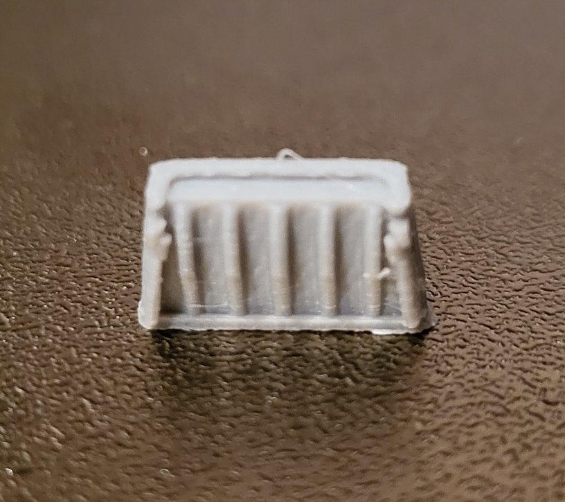

# Thin Walls
Some walls might be too thin to print and even slice. 

We have two options to fix this:
1. Increase the the X-Y Contour Compensation to scale up the model. But it'll make all lines on the model wider and blur the details.

    You also need to watch out for too thin walls that force the slicer to merge two lines together causing the filament to overflow to the sides.

    Here's an example:

    

    And here's how it looks:
    
    

    Even with the too low flow rate which is causing under-extrusion artifacts we are getting a lot of excess filament draged around.
2. Another option is to fix the model! This is probably the best option. But I have no idea how to do it yet...

# Experimenting
I cut out the problematic part of the model and made an experimental plate with three different settings:

1. Original settings

2. Tweaked X-Y Hole Compensation & X-Y Contour Compensation. Hole compensation helped close invisible gaps and reduced the amount of outer walls generated. Contour compensation increased the size of perimeters so print lines stopped intersecting.

3. Enabled thin walls detection. Now the slicer started producing single lines, but the end result has some ugly artifacts.

Here are the print results:

1. 
2. 
3. 