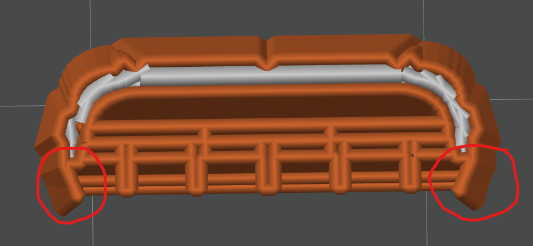
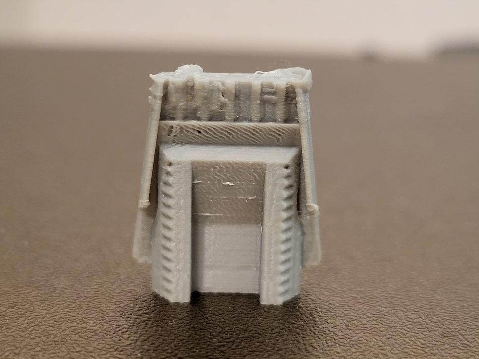
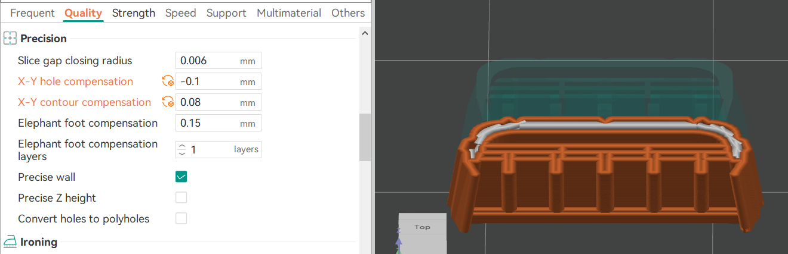
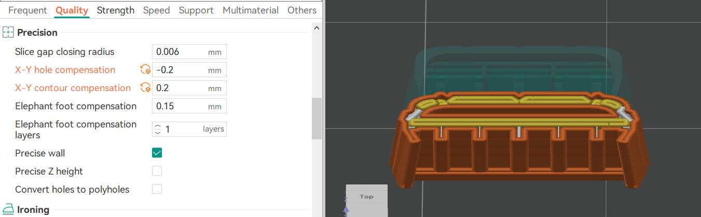
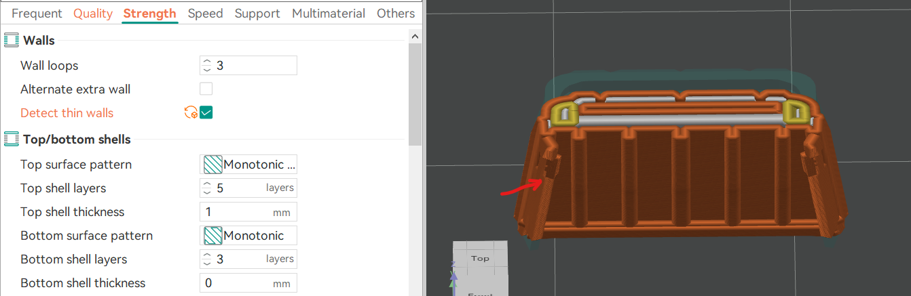
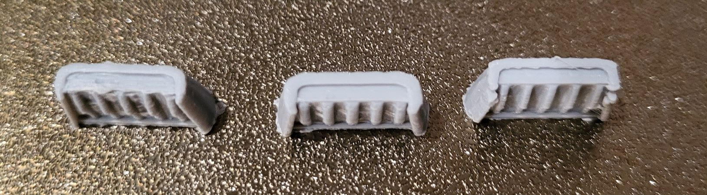
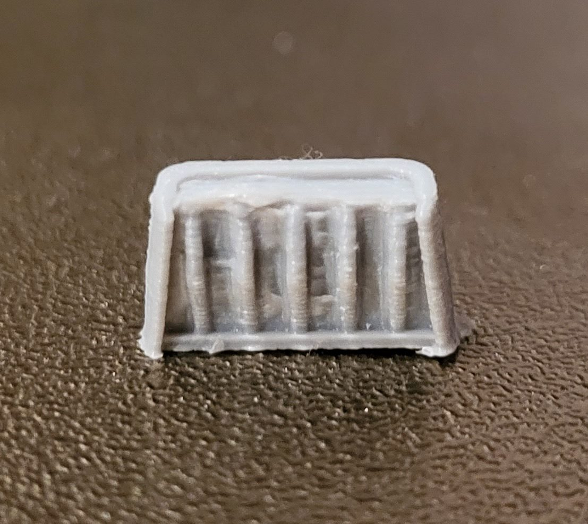
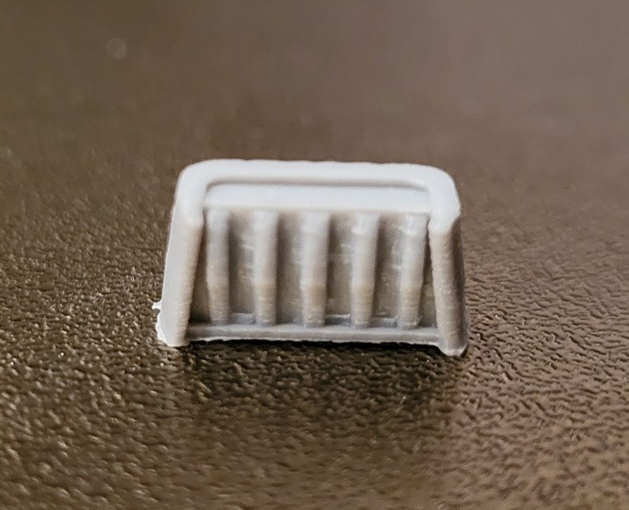
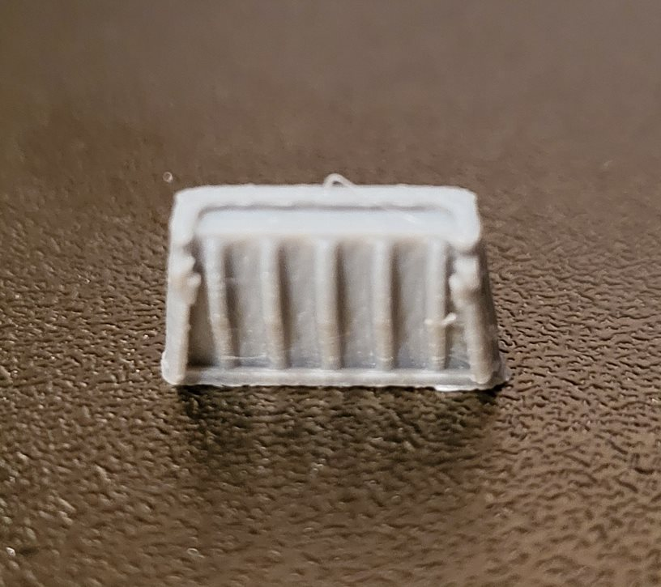

# Thin Walls
Some walls might be too thin to print. In this case the slicer will generate the paths that overlap resulting in over-extrusion.

Here's an example:

And here's how it looks:

# Experimenting
I cut out the problematic part of the model and made an experimental plate with three different settings:

1. Original settings

2. Tweaked X-Y Hole Compensation & X-Y Contour Compensation. Hole compensation helped close invisible gaps and reduced the amount of outer walls generated. Contour compensation increased the size of perimeters so print lines stopped intersecting.

3. Enabled thin walls detection. Now the slicer started producing single lines, but the end result has some ugly artifacts.

Here are the print results:

1. 
2. 
3. 