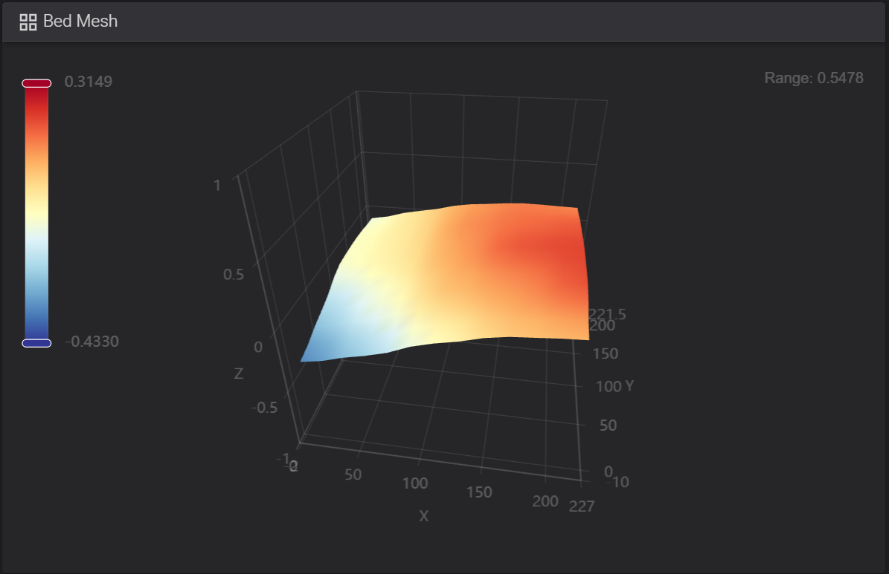

# How To Fix Uneven Bed Mesh
My printer has automatic bed leveling. But the results I get are far from perfect. At some spots the nozzle is too close causing ridges while at other spots it's too far giving me gaps. Tuning z-offset won't fix the issue.

My printer bed is warped and has multiple small areas that are either elevated or sunken. And these areas are not probed because the default bed mesh is configured to have only 5 probing points per axis.

Original bed mesh:


This can be changed to get better precision. Here's the documentation with all the configuration parameters described: [Klipper Documentation: Bed Mesh](https://www.klipper3d.org/Bed_Mesh.html)

So my first attempt was to increase the number of point from 5 to 9. After printing a patch covering the entire bed I could still see a lot of gaps at certain spots. So I increased the number of probing points to 11. This way auto leveling could measure Z more precisely and get a mesh that closely resembles the reality. Except for one single spot that was still missed.

That can also be improved my specifying faulty regions!

What to do:
1. Increase the number of probing points (```probe_count: x, y```) in printer.cfg
1. Print a one layer patch covering the entire surface. Adjust z-offset if necessary.
1. Inspect the patch and see if there are still bad areas. Then either increase the number of points or use Faulty Regions feature. Read the docs, especially the part that explains how more probing points are generated around the faulty reguin and make sure one of the generated point gets as close as possible to the center of the spot you want to fix.