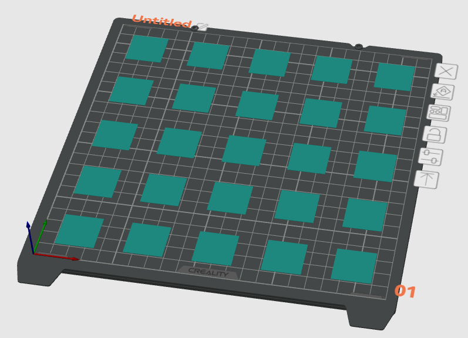

# How To Fix Uneven Bed Mesh
My printer has automatic bed leveling. But the results I get are far from perfect. At some spots the nozzle is too close causing ridges while at other spots it's too far giving me gaps. Tuning z-offset won't fix the issue.

But it's possible to adjust the bed mesh manually for better results.

Here's what you need to do:
1. Open printer config and get the mesh data. Here's how it looks on my printer. Each value is the height or height offset of a probing point. Increasing/decreasing the value a little affects how the printer firmware adjusts the nozzle z position around the point.
  ```
#*# [bed_mesh default]
#*# version = 1
#*# points =
#*# 	  -0.332964, -0.218709, -0.057649, 0.051005, 0.083433
#*# 	  -0.216716, -0.090444, 0.061116, 0.120359, 0.199513
#*# 	  -0.078239, -0.015894, 0.100000, 0.189728, 0.214866
#*# 	  -0.067562, -0.000021, 0.118914, 0.165458, 0.186980
#*# 	  -0.094369, 0.011126, 0.106031, 0.146211, 0.136718
  ```
  
2. Slice a set of one layer patches spread across the bed evenly. The number of patches should match the number of probing points in the mesh. 
1. Print and inspect the results.
1. Update the probe values corresponding to the specific patch you want to fix:
  1. If you see ridges, then the nozzle is too high above. Decrease the height of the probing point a little.
  1. Do the opposite if you see ridges on the patch, i.e. increase the point height to make the nozzle go higher above the point.
1. Save printer config and print again.
1. Iterate till perfection.

### Tips
1. Create an excel sheet with original values, adjustment coefficient and the result for easier manipulation.
2. Gaps are easier to see. Increase z-offset until you see obvious gaps, then lower the corresponding points.
